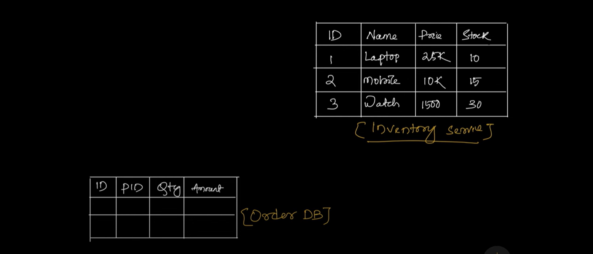
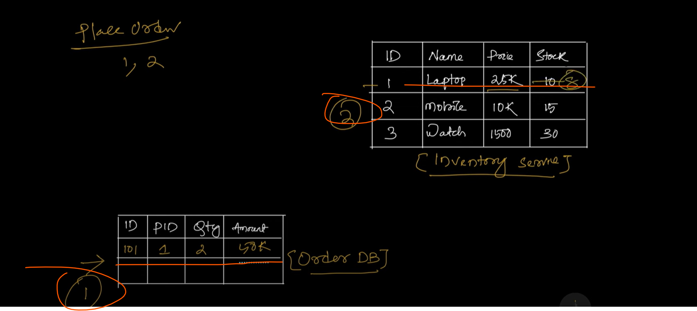
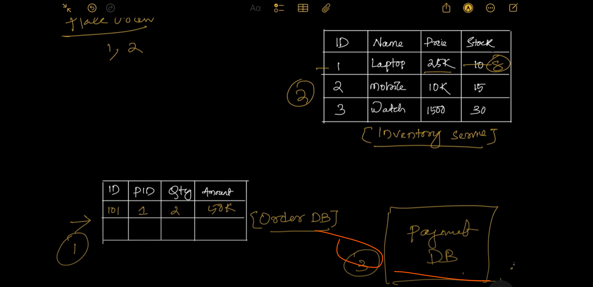
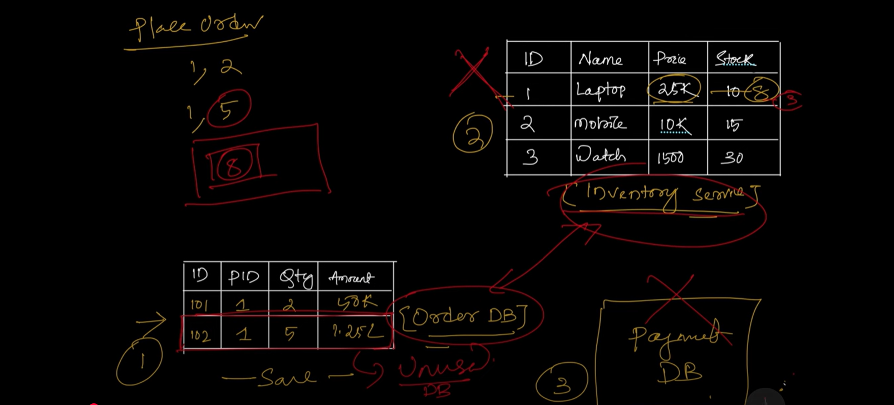
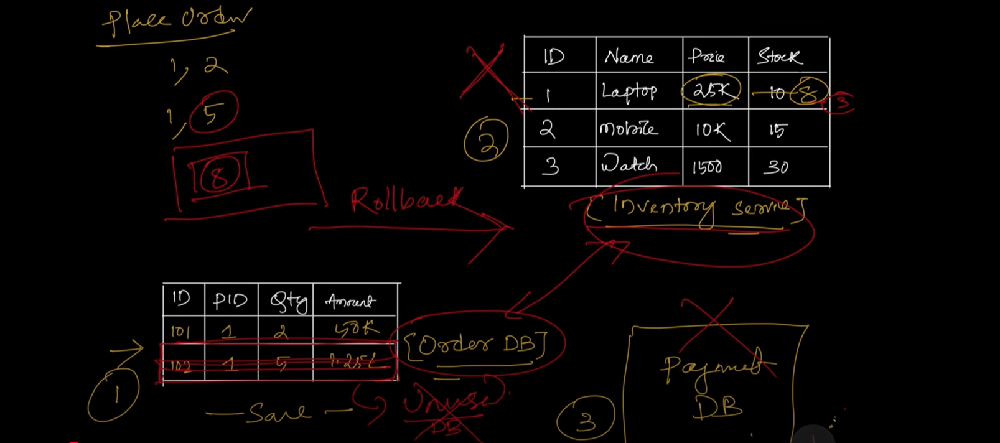
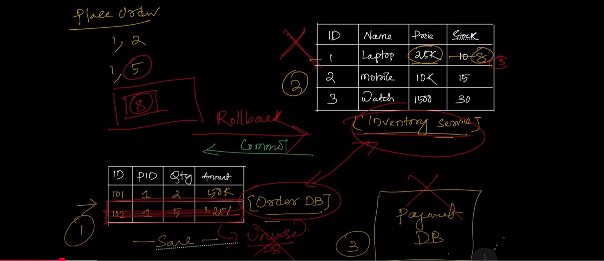
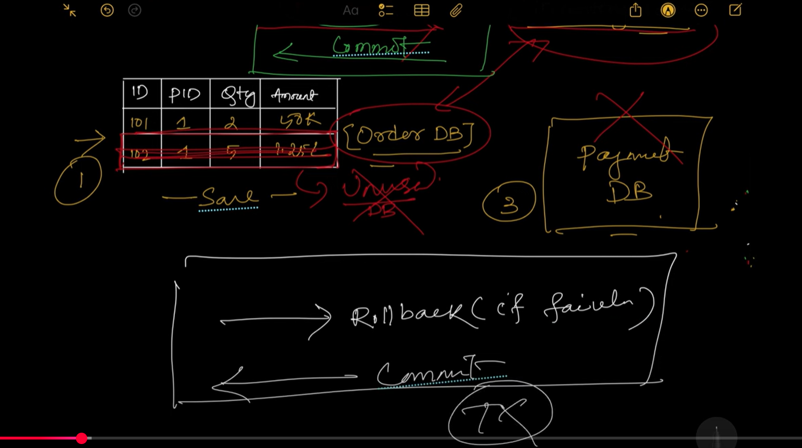

suppose you are working in an e-commerce project where you have an Inventory service and it contains a product details 
like product id, name, price, quantity and stock availability.

suppose user want to place an order with product laptop and he want to put order of 2 laptop, so, first what he will do is
he will first save the order details in order db so step 1 will be save in order db and step 2 will be we also need to update 
the records in inventory db and 3rd step will be you also need to update into a payment db.

=> so here to place an order we are performing 3 different db operations.

But Imagine, while updating record in an inventory db, there is a failure it could be a network glitch or it could be some n/w issue
so we can't update the stock price and stock availability in inventory db now and next step payment also we can't perform but observe
here we already saved the records in our order db so we have unused data in our database. 

Now what will be the problem here User want to search the product laptop in catlog db and the count will show to the user 
is 8 because it is available 8 products in an inventory because the value is not updated which mean the data in the order db
and the inventory db is not consistent so there is an inconsistent data issue in my order db and inventory db which can break my entire system
what i want is i don't want to keep unused data rather what i want is if anything going wrong as part of my flow i want to completely
rollback all the changes from dependent tables if all going good then only commit the changes thats waht all about transaction.

This is the simple principle of a Transaction is If anything going wrong in a flow just Rollback everything If all 
going good then just Commit to the database.

